<div align="center">

# 👋 Welcome to My Profile!

[;Student+at+1337+Programming+School;Software+Engineering+Enthusiast;Building+Projects+One+Commit+at+a+Time;Problem+Solver+%7C+Code+Craftsman)](https://git.io/typing-svg)


</div>

---

## 🚀 About Me

```typescript
const MAN3RAF = {
    name: "Sebar Lahcen (MAN3RF)",
    location: "Morocco 🇲🇦",
    education: "1337 Programming School",
    
    currentFocus: [
        "Software Engineering",
        "Algorithms & Data Structures",
        "Systems Programming",
        "Web Development"
    ],
    
    lifePhilosophy: "Learning, building, and solving problems one commit at a time 🚀",
    
    contact: {
        github: "https://github.com/MAN3RAF",
        profile42: "lsebar"
    }
};
```

<div align="center">

### 🎓 42 Network Badge

[](https://github.com/oakoudad/badge42)

</div>

---

## 💻 Tech Stack & Skills

<div align="center">

### Languages


### Frameworks & Libraries


### Tools & Technologies


</div>

---

## 📊 GitHub Statistics

<div align="center">


</div>

<div align="center">


</div>

<div align="center">

### 🏆 GitHub Trophies

[](https://github.com/ryo-ma/github-profile-trophy)

</div>

---

## 🎯 Current Focus

```mermaid
graph LR
    A[💡 Learning] --> B[Algorithms]
    A --> C[Systems Programming]
    A --> D[Web Development]
    B --> E[🚀 Building Projects]
    C --> E
    D --> E
    E --> F[✨ Growing Skills]
```

<div align="center">



</div>

- 🔭 **Currently:** Deep diving into systems programming and algorithmic problem solving
- 🌱 **Learning:** Advanced C/C++, data structures, and modern web technologies
- 💡 **Projects:** Building real-world applications to solidify concepts
- 🎯 **Goals:** Master software engineering fundamentals and contribute to open source
- 💬 **Ask me about:** C programming, algorithms, code challenges, and collaborative learning
- 📫 **Reach me:** [GitHub Profile](https://github.com/MAN3RAF)

---

## 💭 Daily Inspiration

<div align="center">


</div>

---

<div align="center">

### 🤝 Let's Connect!

[](https://github.com/MAN3RAF)
[](https://github.com/oakoudad/badge42)

---

### 💡 "Code is like humor. When you have to explain it, it's bad." – Cory House


**Thanks for stopping by! Feel free to explore my repositories and connect!** 👋✨

</div>
